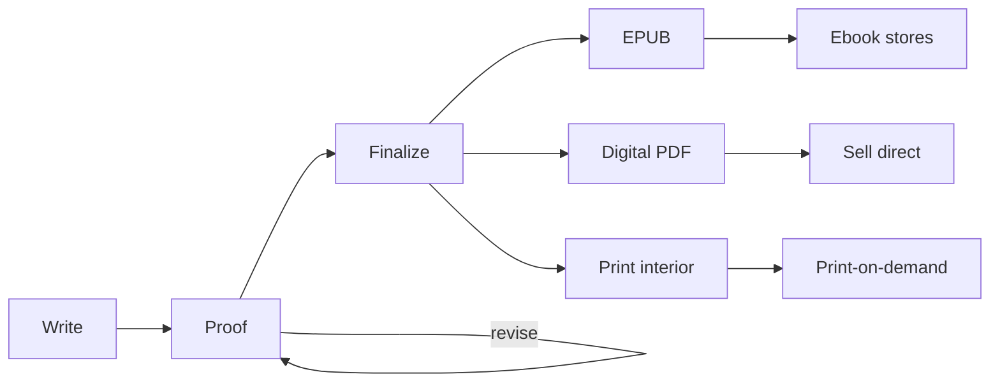

# Publishing your book

You've written a book. unipress turns your folder of markdown into the files a
publisher or store needs — a print-ready PDF, an EPUB, a shareable digital
edition. This guide covers the rest of the journey: what those files are, how to
make them well, and how to get your book onto Amazon, Apple Books, and print-on-
demand services so readers can buy it.

It's written for authors, not programmers. Where a step needs a command, it's one
line. Where it needs a decision (a trim size, an ISBN, a store), it's explained in
plain terms with a link to the authoritative source.

> This guide is about **publishing**. For the full list of `document.yml` settings
> — every trim, font, and structure toggle — see the [`book` template
> reference](../templates/book.md).

## The journey



1. **Write and proof.** Draft in markdown, compile constantly, read, revise.
2. **Finalize.** Set your trim size, add covers and front matter, do a layout pass.
3. **Produce your files.** An EPUB for ebook stores, a print-ready interior for
   print-on-demand, a digital PDF to sell or share.
4. **Publish.** Upload to the stores, order a proof copy, set your price, go live.

## Two builds: a proof and a final

unipress lets one manuscript produce several **cuts** — different shapes of the
same content — from one folder, using [`--variant`](../../README.md#cli-reference).
The recommended setup is two configs side by side:

```text
my-book/
  document.yml         # the PROOF  — unipress compile .
  document-book.yml    # the FINAL  — unipress compile . --variant book
  assets/front.png  assets/back.png
  01-…  02-…  (your chapters)
```

**`document.yml` — your proofing copy (the default).** A comfortable single-column
read on Letter or A4, generous margins for notes, **no covers**. Build it with a
bare `unipress compile .` — fast, so you run it constantly while writing. This is
where you catch typos, awkward sentences, and pacing.

```yaml
# document.yml
format: pdf
paths: { pages: . }
book:
  kind: article      # single column, roomy — easy to read and mark up
  trim: letter       # or a4
content: [ ... ]
```

**`document-book.yml` — your final book (a variant).** The real trade 6×9, with
covers and full front matter. Build it with `unipress compile . --variant book`.
This is the file you send to a store, and — via `--format epub` — your ebook. Build
it near the end to also proof the **layout**: page breaks, widowed lines, where
images land. Things the proofing copy can't show you.

```yaml
# document-book.yml
format: pdf
paths: { pages: . }
book:
  trim: trade-6x9
  structure: { titlePage: true, copyrightPage: true, toc: true, frontMatterNumbering: roman }
  covers: { front: assets/front.png, back: assets/back.png }
content: [ ... ]
```

Why this split? You compile a hundred times while writing, so the least-friction
default should be the fast reading copy. The polished book — heavier, with
full-bleed cover art — is the deliberate "I'm ready to publish" build. There are
two kinds of proofreading, and this covers both: **content** proofing in the proof
copy, **layout** proofing in the final.

> Going to print adds one more cut — a cover-less **print interior** for the
> print-on-demand service. See [print.md](./print.md#the-two-files-you-upload).

## What you'll produce

| File | Build | For |
|---|---|---|
| Proof PDF | `unipress compile .` | Reading and marking up while you write |
| Final PDF (with covers) | `unipress compile . --variant book` | A shareable/sellable digital edition; layout proofing |
| EPUB | `unipress compile . --variant book --format epub` | Ebook stores (Kindle, Apple, Kobo, Google) |
| Print interior PDF | `unipress compile . --variant print` | Uploading to print-on-demand (see [print.md](./print.md)) |

## Before you publish — a checklist

- [ ] **Content** proofread in the proof copy — spelling, grammar, facts, flow.
- [ ] **Layout** proofread in the final variant — no widowed headings, images in
      place, chapters start cleanly, front matter correct.
- [ ] **Trim size** chosen and consistent everywhere ([size-and-layout.md](./size-and-layout.md)).
- [ ] **Covers** sized for your trim, front and back ([covers-and-images.md](./covers-and-images.md)).
- [ ] **Images** are high-resolution enough for print ([covers-and-images.md](./covers-and-images.md#images-in-your-book)).
- [ ] **Title page and copyright page** say what you want, including rights and
      any ISBN ([isbn-and-metadata.md](./isbn-and-metadata.md)).
- [ ] **EPUB validates** ([ebooks.md](./ebooks.md#validate-before-you-upload)).
- [ ] **A physical proof copy ordered and read** before you press publish
      ([print.md](./print.md#order-a-proof-copy)).

## The rest of this guide

- **[size-and-layout.md](./size-and-layout.md)** — trim sizes, margins, bleed,
  front matter, and typography. How to pick a shape for your book.
- **[covers-and-images.md](./covers-and-images.md)** — front and back covers, and
  images inside the book. Dimensions, resolution, and the difference between the
  cover unipress makes and the wrap-around cover a printer wants.
- **[ebooks.md](./ebooks.md)** — what an ebook is, generating and validating your
  EPUB, and the stores and aggregators that sell it.
- **[print.md](./print.md)** — print-on-demand explained, the two files you
  upload, KDP Print vs IngramSpark, and ordering a proof.
- **[isbn-and-metadata.md](./isbn-and-metadata.md)** — ISBNs, the metadata stores
  ask for, and your copyright page.

## What unipress does and doesn't do

unipress produces the **files**: PDF, EPUB, Word, spreadsheet. That's the
technical handoff. It doesn't upload your book, generate ISBNs, design your cover,
edit your prose, or market your book — those are yours (or a professional's) to do.
This guide points you at how.
